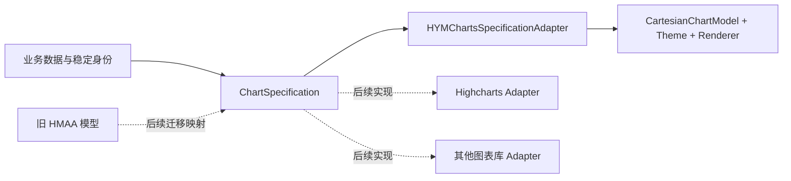

# 通用图表模型与引擎适配层

更新：2026-10-09。此批响应“模型不再绑定 Highcharts”的需求，新增通用描述与 HYMCharts 适配；旧模型转换 R2 和其他第三方适配器仍未完成。

首版完成项见[通用模型任务进度与交接](charts-neutral-model-task-progress-2026-10-03.md)；G1 v2 后续增量见[对应进度](charts-neutral-g1-task-progress-2026-10-03.md)。

同日已补[197 项 schema 覆盖矩阵](charts-neutral-model-coverage.md)：逐项区分中立模型、原生能力与适配器支持，以及外层/运行时/兼容层职责。**模型没有某字段**不等于适配器已经为它提供拒绝诊断；旧字段 mapper 必须在信息丢失之前报告差异。当前 `HMAAYAxis.unit` 的旧实现是刻度值后缀，不是轴标题，迁移时不要与系列单位混淆。

## 设计结论

业务依赖 `ChartSpecification`，适配器依赖业务描述与具体引擎。换库时替换适配器；不要求业务把 `areaspline` 改成另一家库的类型字符串。通用模型保存**数据和展示意图**，引擎保留自己的渲染模型、缓存、对象生命周期及性能配置。



同一层可以接不同图库，但不能保证它们具备相同能力或像素效果。每个适配器必须做能力检查：支持则转换，不支持则返回字段路径和原因。**不能把真实数值 X 偷换成等距索引，也不能把不认识的样式静默丢掉。** 外观未显式指定时接受目标引擎默认值；虚线节奏、默认主题等允许随引擎变化。

首版是当前业务需要的**轴系模型**：折线、面积、柱条、混合。没有为饼图、雷达、热力图、范围带等塞入大量无效可选字段。`ChartAdapter` 的 `Input`/`Output` 为关联类型，后续可以分别添加适合这些图形的数据模型，同时沿用诊断契约。

## 文件职责

| 文件 | 职责 |
|---|---|
| [ChartSpecification.swift](../SwiftFunctionProject/Charts/Specification/ChartSpecification.swift) | 根描述、方向、业务组、明确分母的数学堆叠 |
| [ChartDataSpecification.swift](../SwiftFunctionProject/Charts/Specification/ChartDataSpecification.swift) | 类目/数值/时间坐标、采样、系列、图元和插值 |
| [ChartAppearanceSpecification.swift](../SwiftFunctionProject/Charts/Specification/ChartAppearanceSpecification.swift) | 平台无关颜色、面积填充、轴外观、数字格式 |
| [ChartInteractionSpecification.swift](../SwiftFunctionProject/Charts/Specification/ChartInteractionSpecification.swift) | v6 Tooltip 内容/取值、图例布局和校验 |
| [ChartAnnotationSpecification.swift](../SwiftFunctionProject/Charts/Specification/ChartAnnotationSpecification.swift) | v5 值轴标线/色带、标签样式和校验 |
| [ChartAxisPresentation.swift](../SwiftFunctionProject/Charts/Specification/ChartAxisPresentation.swift) | v4 系统字重与可序列化值轴标签格式 |
| [ChartSpecificationCoding.swift](../SwiftFunctionProject/Charts/Specification/ChartSpecificationCoding.swift) | 显式 JSON 枚举格式，避免 Swift 合成 `_0` 键成为文件协议 |
| [ChartSpecificationVersionCoding.swift](../SwiftFunctionProject/Charts/Specification/ChartSpecificationVersionCoding.swift) | v1–v6 兼容、边界、分区、轴展示、标注和交互保留键检查；禁止静默降级 |
| [ChartSpecificationValidation.swift](../SwiftFunctionProject/Charts/Specification/ChartSpecificationValidation.swift) | 纯输入校验，不依赖绘图实现 |
| [ChartAdapter.swift](../SwiftFunctionProject/Charts/Specification/ChartAdapter.swift) | 适配协议、结构化诊断、Swift Error / OC NSError |
| [HYMChartsSpecificationAdapter.swift](../SwiftFunctionProject/Charts/Adapters/HYMChartsSpecificationAdapter.swift) | HYMCharts 能力检查、稀疏数据对齐、模型/主题转换、原始采样查回 |
| [HYMChartSpecificationDocument.swift](../SwiftFunctionProject/Charts/OCBridge/HYMChartSpecificationDocument.swift) | OC 不可变 JSON 快照与原生图表创建入口 |

`Specification/` 仅导入 Foundation，全部模型是 `Codable / Equatable / Sendable` 值类型。可独立编译，不继承现有 `HYMChartModel` marker 协议。UIKit 和已有 Cartesian 类型只出现在适配/展示层。

## 必须保持的语义

- `chart.id`、`series.id`、`sample.id`、`axis.id`、`category.id` 都显式提供。名称可以重复，改名和重排不改变身份。样本身份是 `(seriesID, sampleID)`；适配器不生成随机 UUID。
- 类目样本通过 `categoryID` 对齐，允许稀疏和乱序。类目显示顺序取自 domain。缺少整个样本与存在一个 `value=nil` 的样本可分别查回，均不虚构业务值。
- `nil` 表示缺测、`0` 表示有效零值；NaN/Infinity 是无效输入。NaN 仅在 HYMCharts 渲染数组中充当占位，不进入原始模型或持久化 JSON。
- `mark` 描述 line/area/bar；`interpolation` 描述 linear/monotone/三种阶梯；`orientation` 决定垂直/水平。旧 `areaspline` 对应 area + monotone。
- `groupID` 只负责业务展示。`stackID` 只负责数学堆叠；nil 表示不参与。堆叠键包含值轴 ID、柱/线面积图形族和 stackID；同一键禁止混合不同单位。
- sum 正负分别累计。percentOfAbsoluteTotal 用同组可见原值的绝对值和作分母，因此 +60/-40 为 +60%/-40%，不会各拉满 100%。percentOfFixedTotal 使用显式正分母。
- 数值格式只影响展示，绝对值、截断、单位与货币符号不重写 raw 值；不保存 `fdata/fgdata/showSeriesArray` 等派生缓存。
- 轴通过 ID 绑定；当前原生适配器按 `valueAxes` 顺序映射主/次轴。更换顺序会改变展示侧，但系列仍绑定正确的语义轴。
- 数值和时间域是实际坐标；时间单位为 Unix 秒。时间/数值样本必须严格递增。首版不含散点式任意坐标排列。

## Swift 使用

```swift
let specification = ChartSpecification(
    id: "power-trend",
    title: "功率趋势",
    domain: .categories([
        .init(id: "08", label: "08:00"),
        .init(id: "09", label: "09:00")
    ]),
    valueAxes: [.init(id: "power")],
    series: [
        .init(
            id: "solar", name: "光伏", mark: .area, valueAxisID: "power",
            samples: [
                .init(id: "solar-08", coordinate: .category("08"), value: 100),
                .init(id: "solar-09", coordinate: .category("09"), value: nil)
            ],
            unit: "W", interpolation: .monotone
        )
    ]
)

// 后台可以生成、编码、校验 specification；创建 UIKit 配置在主线程。
let output = try HYMChartsSpecificationAdapter().makeConfiguration(from: specification)
let chart = HYMChartView<LineChartRenderer>(frame: .zero)
chart.configure(model: output.model, theme: output.theme)
// output.kind 表明所需 renderer；混合系列必须使用 CombinedChartRenderer。

// 原生回调中的 seriesID/categoryIndex 可查回业务采样及 metadata。
let sample = output.sourceSample(seriesID: "solar", categoryIndex: 0)
```

SwiftUI 使用同一适配结果创建 `LineChart / ColumnChart / BarChart / CombinedChart`；须按 output.kind 选择，不能把柱线混合结果交给纯折线 renderer。已提供 [完整可编译示例](../Examples/ChartSpecifications/GenerateExample.swift) 和由同一模型生成的 [JSON](../Examples/ChartSpecifications/energy.json)。

## Objective-C 使用

```objc
NSError *error = nil;
HYMChartSpecificationDocument *document =
    [[HYMChartSpecificationDocument alloc] initWithJSONData:data error:&error];
if (!document) { /* 展示 error 中的输入问题 */ return; }

HYMCartesianChartViewBridge *bridge =
    [document makeNativeBridgeWithFrame:CGRectMake(0, 0, 360, 300) error:&error];
if (!bridge) { /* 该引擎不支持某些配置 */ return; }
self.chartBridge = bridge; // 调用方持有 bridge
[self.view addSubview:bridge.chartView];

// 新文档是不可变快照。失败时保留上一张有效图；成功时默认可保留视口。
BOOL updated = [bridge updateWithSpecification:newDocument
                              preserveViewport:YES error:&error];
NSString *sampleID = [document sampleIdentifierForSeriesID:@"solar" categoryIndex:0];
```

首版 OC 通过版本化 JSON 读写模型，无需使用 Swift struct/关联值枚举。暂未为所有字段另做一套可变 NSObject builder。JSON 有明确的 `kind/mode` 判别字段，null 表示缺测；可从示例修改或由服务端/业务映射层生成，不接受 Highcharts options 作为通用模型。

`ChartSpecification.decodeJSON` 和 OC document 会做模型校验；直接 `JSONDecoder().decode` 只是解码，后续仍须 validate 或交给适配器。当前可读取 v1–v6，默认构造仍为 v1；v2 及以后均必填 `stackedAreaBoundary`。v3 允许逐系列 `appearance.valueColorZones`；该键出现在 v1/v2（包括 null）会明确拒绝。v4 轴展示保留键出现在 v1–v3（包括 null/错误类型）同样拒绝，具体路径见下节。未知版本/枚举值拒绝；Codable 对其他额外对象键遵循 Swift 默认忽略行为，不能借未声明键传递引擎配置；已保留的 `stackedAreaBoundary` 若出现在 v1 中则明确报错。schema 变更应显式升级版本并提供迁移，不能依赖忽略未知键实现兼容。

模型校验/能力错误的 `NSError.domain` 为 `HYMCharts.Specification`，`userInfo["issues"]` 含 code/path/message，后端能力错误附带 backendIdentifier。JSON 语法或字段类型错误保留 Codable 的解码错误。调用方应处理错误，不能捕获后改用默认图表掩盖问题。

## 本轮支持范围与未实现项

| 项目 | 通用描述 | HYMCharts 适配器 |
|---|---|---|
| 类目 / 稀疏数据 / 稳定样本身份 | 已实现 | 已实现 |
| line / area / bar、插值、混合 | 已实现 | 已实现；水平只支持 bar |
| 多值轴与反向轴意图 | 已实现 | 垂直最多双轴，水平单轴；反向报错 |
| 轴网格 | 按语义轴独立声明 | 主轴/类目映射到正确屏幕方向；当前仅开次轴、关闭主轴的组合报错 |
| 真实数值 X、Unix 时间 X | 已建模 | 明确报错，不生成等距替代图 |
| 业务组 / 堆叠组 / 原值格式 | 已实现 | 已实现；无自动业务组求和 |
| 颜色、负值色、线宽/虚线、marker、面积渐变、值标签 | 基础覆盖 | 有效配置转换；柱图的折线/marker 配置报错 |
| 完整 Highcharts / ECharts / DGCharts 适配 | 协议可扩展 | 尚未实现，未验证这些库运行 |
| 自动旧模型转换及 197 字段迁移 | 后续独立 mapper | 尚未实现 |
| G1 堆叠边界模式 | v2 三种模式；v1 固定 independent | 显式映射原生 theme；不改业务数据 |
| 轴刻度 / 类目候选间隔 / 系统字重 / 标签格式 | v4，轴配置按稳定 ID 独立 | 四种 renderer 已映射；不改变数据/坐标能力 |
| 值轴颜色分区 | v3，逐系列半开阈值；柱 raw/draw，线/面积 draw | 按绑定值轴映射；线/面积 raw 明确报路径错误 |
| 值轴标线/色带及标签样式 | v5，稳定标注 ID / valueAxisID | 固定层次，隐藏源项保留，裁剪不扩域 |
| Tooltip 内容／取值、图例布局 | v6，稳定系列 ID 规则、可选宿主接管 | 四类 renderer；OC bridge 自动应用，Swift 同步应用 view 配置 |
| X 分区、分区填充、完整 Tooltip/图例 | 其余部分尚未纳入通用 schema | 原生现有 API 保留，不宣称完整迁移 |
| 自适应深浅色、任意图片/字体/回调、动画与采样 | 后续资源/主题/运行时配置 | 不把 UIKit 对象和闭包塞进可序列化模型 |
| 统计表头、日出日落、全屏容器、强制空态 | 业务 UI 层 | 不放入图表数学模型 |

### N4 v6：Tooltip 内容／取值与图例布局（2026-10-09）

共享示例 [energy-interaction-v6.json](../Examples/ChartSpecifications/energy-interaction-v6.json) 由同一个 Foundation-only 生成器输出，Swift 与纯 OC 宿主读取同一份 JSON；不修改 v1–v5 样例或默认构造版本。

| 字段 | 契约 |
| --- | --- |
| `tooltip` | nil：使用宿主；非 nil：覆盖已建模内容。`isEnabled=false` 只关闭内置提示，不删除系列或关闭命中回调 |
| `layout / position` | text/columns 与 automatic/fixedTop；固定顶部不锁定当前选择，不定义旧超时或抬手策略 |
| `headerTemplate / hidesZeroValues` | nil 不加表头；仅替换 `{key}`，始终是当前命中标签；精确零值过滤使用偏移后的展示值 |
| `seriesRules[seriesID]` | 稳定系列 ID 的 `isHidden / hidesValue / title`；nil 标题沿用宿主标题或系列名，空标题有效。过滤不改变绘制、堆叠、百分比分母和图例 |
| `sampleSelection` | 全局 `offset`、逐系列 `offsetsBySeriesID`、omit/clamp/current、来源标签及模板。显式 0 覆盖全局偏移；负数表示前面的类目槽位，而非稀疏 samples 数组位置 |
| `legend` | nil 沿用适配器原有默认图例；非 nil 指定屏幕四方向、行对齐、scroll/expand、最大行数/宽高、点击显隐、相邻组换行、逐系列标题；不改变系列顺序 |

偏移越界时：omit 省略该行，clamp 钳到端点，current 使用当前命中；Int 极值安全处理。**缺测始终省略，不向前寻找有效值**。`row.datum` 仍为当前命中、`displayedDatum` 为取值点；来源标签仅位置变化时添加，header／准线／样本查回都不跟随偏移。实际聚合桶仍遵循原生“取当前桶”规则，不对桶应用单点偏移。非默认取值配置仅适用于类目域，不能当作连续时间或数值距离；G6 仍明确拒绝。

**2026-10-09 布局质量补充**：N4 `.fixedTop` 适配时自动启用原生 `fixedTopUsesPlotArea`，将内置提示限制在最终绘图区与容器 bounds 的交集，避免覆盖标题、图例和轴标签区；顶部间距与 offset 相对该边界。它仍覆盖数据，不预留专用区域、不修改绘图区或坐标。原生默认 false 保持旧行为；automatic 不受此开关影响，null／旧文档恢复宿主的独立运行时基线。不新增 JSON 字段，不升级 schema；详见[布局质量进度](charts-neutral-tooltip-layout-task-progress-2026-10-09.md)与[原生位置指南](charts-tooltip-selection-guide.md)。

图例 `maxRows > 0`，尺寸是有限的 0...1e9 point，0 可使图例没有可用空间；expand 仍保护原生最小绘图区，不撑大宿主 frame。左右为单列，上下按行对齐；所有位置均指屏幕方向，水平 Bar 不翻转这些名称。总开关继续是 `showsLegend`，成员资格是 `showsInLegend`，初始绘制显隐是 `isVisible`。Tooltip 标题和图例标题互不替换。

**Swift 应同时应用 model、theme 和 Tooltip 配置**（后者属于 view，不会仅靠 model/theme 自动设置）：

```swift
var described = specification
// 本例假定 specification 中有稳定 ID 为 solar 的系列。
described.schemaVersion = 6
var tooltip = ChartTooltipSpecification()
tooltip.layout = .columns; tooltip.position = .fixedTop
tooltip.headerTemplate = "当前 {key}"
tooltip.sampleSelection.offset = -1; tooltip.sampleSelection.boundaryPolicy = .clamp
tooltip.sampleSelection.offsetsBySeriesID = ["solar": 0]
described.tooltip = tooltip
var legend = ChartLegendSpecification(); legend.position = .top
legend.titlesBySeriesID = ["solar": "光伏发电"]
described.legend = legend
let output = try HYMChartsSpecificationAdapter().makeConfiguration(from: described)

// 宿主基线独立保存；不要把上一次适配结果再次当成 runtime 传入，避免旧规则串联。
let runtimePresentation = CartesianTooltipPresentation()
let runtimeTheme = HYMChartTooltipTheme.default
chart.showsTooltipOnHit = output.tooltip?.isEnabled ?? true
chart.tooltipTextOptions = output.tooltip?.textOptions ?? .init()
chart.cartesianTooltipPresentation = output.tooltip?.presentation(preservingRuntime: runtimePresentation) ?? runtimePresentation
chart.cartesianTooltipSampleSelection = output.tooltip?.sampleSelection ?? .init()
chart.tooltipTheme = output.tooltip?.theme(preservingRuntime: runtimeTheme) ?? runtimeTheme
chart.configure(model: output.model, theme: output.theme)
```

示例以默认宿主设置作为基线；实际宿主应保存自己的 textOptions、sampleSelection、开关和 theme。SwiftUI 包装器也接受这些 Tooltip 参数（见同页 Demo），轻点共享提示是否开启仍由宿主手势设置控制。N4 不序列化手势策略。

**运行时优先级**：非 nil Tooltip 提供平铺内容，不自动启用业务分组／小计；数值格式与单位仍用系列配置。`presentation(preservingRuntime:)` 保留图片/provider 和间距，对命中的系列规则覆盖隐藏／隐藏数值，只有非 nil 标题覆盖宿主标题；未命中规则仍用宿主 provider。`theme(preservingRuntime:)` 覆盖位置，并在 fixedTop 时开启 `fixedTopUsesPlotArea`；automatic 保留宿主该开关值但不使用。颜色、字体、偏移、动画仍由宿主控制，不入 schema。不要通过 runtime provider 期待与某条中立规则矛盾的开关仍然优先。

**Objective-C** 使用既有 `HYMChartSpecificationDocument` 与 `makeNativeBridge/updateWithSpecification` 即可；桥接自动应用 N4。每次更新先由 `tooltipOptions` 和桥接开关重建独立宿主基线；从 v6 对象切回 v1–v5 或 `tooltip:null` 时恢复该基线，不残留旧覆盖。非法文档、失配 renderer 或后端不支持组合在修改 view 前报错，保留有效图、提示配置和视口；成功更新按 `preserveViewport` 执行并清理旧提示。

**版本**：v6 顶层 `tooltip` 与 `legend` 两键都必须存在，可以是 null；对象中的非可选字段必须完整，不能以 `{}` 代替默认对象。v1–v5 这两个保留键即使为 null、空对象、错误类型也拒绝。降级前必须将二者置 nil，包括关闭状态下的默认对象；普通 `JSONEncoder` 与辅助编码入口同样验证，不能静默丢配置。未知枚举、失效／空系列引用和非法尺寸拒绝，隐藏配置也不豁免校验。可选标题／表头的缺失或 null 视为 nil。

**本轮未做**：逐 sample ID 表头／名称／隐藏点、动态组标题、组级 onlyName／业务小计、图片资源协议、Tooltip 字体／颜色、图例符号／背景／资源，以及旧输入 mapper、第二实际后端、G6。不要把 N4 有限切片当成完整 Tooltip/图例迁移。验证范围与后续入口见 [N4 进度](charts-neutral-interaction-task-progress-2026-10-09.md)。

### N3 v5：值轴标线／色带（2026-10-09）

复用原生 G4 的固定层次，不改变坐标／值域／命中。共享示例 [energy-annotations-v5.json](../Examples/ChartSpecifications/energy-annotations-v5.json) 包含主次轴标线、隐藏项和带透明度色带，Swift 与纯 OC 宿主载入同一份文档。

```swift
var annotated = specification
annotated.schemaVersion = 5
annotated.plotLines = [ChartPlotLine(id: "limit", valueAxisID: "power", value: 40,
    lineWidth: 2, strokePattern: .dashed, label: "上限",
    labelStyle: .init(fontSize: 13, fontWeight: .semibold, alignment: .leading))]
annotated.plotBands = [ChartPlotBand(id: "range", valueAxisID: "power", from: 10, to: 30,
    color: .init(red: 0, green: 0.6, blue: 0.3, alpha: 0.18), label: "区间")]
let output = try HYMChartsSpecificationAdapter().makeConfiguration(from: annotated)
```

**版本／失败策略**：v5 必须保存两个数组（可空）；缺失、null、类型错误拒绝。v1–v4 遇到任一标注保留键即拒绝，即使空数组或 null。内存中非空数组不允许降级，包括隐藏项；清空数组后仍须遵守其他 v2–v4 字段降级规则。`decodeJSON` / document 做完整校验；直接 `JSONDecoder` 只做解码及版本检查，后续仍需 validate / adapter。

**身份／坐标**：所有标线和色带 ID 统一非空唯一；`valueAxisID` 必须指向已声明轴，重排后重新解析原生索引。标线值有限，色带有限且严格 `from < to`（不交换端点）。坐标用逻辑值轴单位，百分比为百分数；部分越界带裁剪、完全越界线／带不画，绝不扩域。`isVisible=false` 仍校验并保留源项，不进入绘制数组，也不创建虚拟系列或影响原值、堆叠分母、图例、选择。

**样式／边界**：可选 sRGB RGBA、非负有限线宽、solid/dashed/dotted；文字、颜色与底色独立（HYM nil 文字色跟随标注；色带文字取不透明 RGB），字号正有限、系统九字重。字号／字重同时 nil 时 HYM 继承主题刻度字号与 medium；只覆盖字号时默认 medium。水平 leading/center/trailing 和垂直 top/center/bottom 均为屏幕方向，automatic 保留原生位置。偏移先于边界处理，有限且绝对值 ≤ 1e9。clamp 限宽尾截再钳入绘图区，高度不足隐藏；hide 完整文字越界就隐藏。多个标签互相避让不在本切片内。

**固定层次／非目标**：带体在系列后，标线和标签在系列前。支持 Line / Column / Combined 主次轴与 Bar 主值轴；不支持 X/类目标注、任意 zIndex、自定义字体资源、执行式 formatter，不解除 G6 拒绝。更多覆盖与限制见 [N3 进度](charts-neutral-annotations-task-progress-2026-10-09.md)。

### N2 v4：轴展示（2026-10-09）

复用既有原生 G3 轴能力，不修改值域/绘制/命中算法。共享示例 [energy-axes-v4.json](../Examples/ChartSpecifications/energy-axes-v4.json) 同时用于公开 Swift 和纯 OC 宿主。

```swift
var axes = specification
axes.schemaVersion = 4 // 显式升级；已有 v1–v3 不被自动改写
axes.categoryLabelInterval = 2
axes.domainAppearance.labelFontWeight = .medium
axes.valueAxes[0].appearance.labelFontWeight = .bold
axes.valueAxes[0].tickPositions = [-100, -50, 0, 50, 100]
var number = ChartValuePresentation()
number.localeIdentifier = "en_US_POSIX"
axes.valueAxes[0].labelFormat = .init(number: number, unit: "%")
let output = try HYMChartsSpecificationAdapter().makeConfiguration(from: axes)
```

| 字段 | 契约 |
| --- | --- |
| `ChartAxisSpecification.tickPositions` | nil 自动；`[]` 明确不生成值轴刻度与同源网格；非空必须有限、严格递增。域外值允许，但 HYM 仅使用有效域内刻度（保留原生边缘浮点容差），不借刻度扩域、不排序/去重。主/次轴独立。 |
| `ChartSpecification.categoryLabelInterval` | nil 自动；正整数为类目标签候选间隔，按**原始绝对类目索引**取模。窄屏可按候选间隔的整数倍避让；不保证显示所有候选，不抽样数据。仅类目域允许；不是值轴间隔。水平 Bar 的类目在屏幕 Y。 |
| `ChartAxisAppearance.labelFontWeight` | nil 保持旧行为；`ultraLight / thin / light / regular / medium / semibold / bold / heavy / black`。域轴及各值轴可独立设置；仅字重继承默认字号，仅字号仍用 regular；自定义字体文件、任意名称不在此契约。 |
| `ChartAxisSpecification.labelFormat` | nil 保留引擎自动格式；非 nil 显式使用 `number: ChartValuePresentation` 与可选 `unit`。小数位 0...12，复用舍入、分组、工程缩写等现有格式语义；locale nil 用宿主当前值，可显式指定。 |
| `ChartAxisLabelFormat.unit` | 显示后缀，不是轴标题、系列单位或换算。HYM 非空后缀前加空格，工程缩写前缀在单位前，例如 `-1.5 kW`；不需要单位后缀时将 unit 设为 nil 或空串。百分比轴须由调用方显式指定 `%`，不自动猜测。 |

五处新保留键：顶层 `categoryLabelInterval`、`domainAppearance.labelFontWeight`、`valueAxes[i].tickPositions`、`valueAxes[i].labelFormat`、`valueAxes[i].appearance.labelFontWeight`。v1–v3 即使给 null 或错误类型也拒绝；直接 `JSONDecoder` 同样进行版本拦截。直接 `JSONEncoder` 先 validate，不能降级丢字段。v4 仍必填 G1 边界，可与 v3 值轴颜色分区共存。旧三版 JSON 示例逐字节保持不变。

轴配置不重写原值、缺测、采样/系列 ID、系列单位或百分比计算；适配结果 source 保留原文。OC 沿用不可变 document 和 bridge 更新；失败不替换有效图表，视口保留/重置策略不变。G6 连续 X/反向轴、水平次值轴的后端拒绝不放开。值轴 tickInterval/tickCount、类目旋转、自定义字体、任意格式化代码、旧业务单位政策均不在 N2 范围。

轴标签继承原生边带限宽/冲突省略政策，不保证每个显式刻度的文字都能完整显示；本批 Bar 截图的右端 `150 W` 截为 `15…`，不等同于格式化丢失单位或数学值变化。窄屏/大字号的布局改进与深色对比度仍是独立质量待办。

同页 Demo 提供轴 ID 选择、显式刻度/单位格式预设、系统字重、类目间隔及垂直图次轴开关；临时关闭次轴保存其设置，恢复默认才清空。已核对 `DemoThemeFields` 的全局字体控制和 `CartesianDemoSettings` 的独立轴刻度/字体/后缀控制；本批只增加中立预览，不重复登记原生字段。详见 [N2 专项测试](../SwiftFunctionProjectTests/ChartSpecificationAxisPresentationTests.swift)。

### N1 v3：值轴阈值颜色（2026-10-09）

[ChartValueColorZones.swift](../SwiftFunctionProject/Charts/Specification/ChartValueColorZones.swift) 仅依赖 Foundation，示例见 [energy-zones-v3.json](../Examples/ChartSpecifications/energy-zones-v3.json)。

```swift
var zoned = specification
zoned.schemaVersion = 3 // 显式升级；不会自动改写旧文档
zoned.series[0].appearance.valueColorZones = ChartValueColorZones(
    valueSource: .drawValue,
    zones: [
        .init(upperBound: 0, color: .init(red: 0.85, green: 0.16, blue: 0.22)),
        .init(upperBound: 50, color: .init(red: 0.95, green: 0.55, blue: 0.10)),
        .init(color: .init(red: 0.08, green: 0.62, blue: 0.40))
    ])
let output = try HYMChartsSpecificationAdapter().makeConfiguration(from: zoned)
```

- 区间为 `[前一上界, upperBound)`，首段下界为负无穷；等于阈值属于下一段。阈值须有限且严格递增；至少一段；nil 上界仅允许最后一段，代表正无穷。
- 尾部未配置到正无穷、或区间 color 为 nil 时继承**系列色**，不重新套用 negativeColor。有效分区优先于原生逐柱/负值颜色。`valueColorZones = nil` 关闭，恢复既有默认。
- `.rawValue` 是业务原始贡献；`.drawValue` 是包含基线的最终值轴坐标。例如自身 20、前层 50 时分别比较 20 与 70。自动/固定分母百分比的 draw 单位为 %，raw 仍为原单位。隐藏前层会影响 draw，不会改写 raw。
- 绑定哪个 valueAxisID 就使用哪个轴的单位，主次轴不混用；水平 Bar 仍是逻辑值轴，不能当 X 类目索引。Combined 柱族和线族独立。
- HYM 支持柱/条 raw/draw；线/面积仅 draw。线/面积 raw 是可序列化的中立意图，但此后端在 `series[i].appearance.valueColorZones.valueSource` 明确报 unsupportedCapability，包括隐藏系列。
- 首批只控制线/marker/柱条颜色，**不覆盖既有面积填充**；不包含分区渐变或 X 分区。不是“旧 zones 整体迁移完成”，也未实现 G6。未知对象键仍由 Codable 忽略，旧 mapper 必须在丢失未建模信息前诊断。
- 颜色必须为 0...1 有限 RGBA；无效阈值/颜色报逐项 invalidInput，不使用原生无效 zones 的静默回退。直接 JSONEncoder 同样拒绝把分区降为 v1/v2；v3 未开启分区仍是合法文档。
- v1/v2 示例保留原编码；v3 保留 G1 必填边界。OC 沿用 `HYMChartSpecificationDocument`，用同一 JSON 创建/更新 bridge，无需再维护可变包装类型。失败更新不污染上一有效图表或视口。

四类既有页面的“通用模型”内有逐系列 ID 选择、阈值预设（0/50）开关、柱族原值/绘制值选择，以及全量恢复默认。设置保存于稳定 ID，不跟随当前选择或显示名称移动。原生 `DemoThemeFields` 不重复注册中立模型专用字段。

### G1 v2：明确升级，不改旧文档默认

```swift
var shared = specification
shared.schemaVersion = 2
shared.stackedAreaBoundary = .diverging
let output = try HYMChartsSpecificationAdapter().makeConfiguration(from: shared)
// output.source 保留 ID、原始正负值、缺测；output.theme 显式启用原生正负分链。
```

也可在构造器末尾明确传入 `schemaVersion: 2, stackedAreaBoundary: .diverging`。`latestSchemaVersion == 5` 表示最新可读版本，**不改变默认构造器的 v1**。

| 输入 / 操作 | 行为 |
| --- | --- |
| 已有 v1 JSON（无新字段） | 读取为 independent；重新编码不添加字段，既有 energy.json 保持逐字节一致 |
| v1 夹带 `stackedAreaBoundary`（含 independent 或 null） | 报字段错误，避免把意图藏在旧版本的未知键里 |
| v2/v3/v4 JSON | 必须明确填写 independent / followBaseline / diverging；缺失、null 或未知值拒绝 |
| v2 读入旧 v1 SDK | 旧 SDK 的版本校验拒绝 v2；调用方必须使用 decodeJSON/适配器而非绕过校验 |
| 非独立模式直接改回 schemaVersion=1 | validate、jsonData、直接 JSONEncoder 都拒绝；显式选择 independent 后才能降级 |
| 新建非独立模式但未启用堆叠 / 只有柱 / 无参与 stackID | 通用校验返回 stackedAreaBoundary 错误；隐藏的线/面积系列仍可形成合法配置 |

- **independent**：兼容累计边界独立插值，不承诺薄层不交叉。
- **followBaseline**：沿已有基线插值面积厚度，保留逐系列缺测规则；纯折线仍按原生连线方式绘制。自动百分比先插值采样份额，无法共享基线时允许兼容回退。
- **diverging**：线族按值轴/stackID 分组，插值原始贡献后分别累计正负。任何可见参与系列缺测即共同断段，优先于 `missingValues.connect/connectUpTo`；隐藏系列、独立系列和柱族不切断此组。
- 自动百分比使用同组 `Σ|贡献|` 分母，+60/-40 为 +60%/-40%，不是两侧各 100%。固定分母保持调用方分母。原始零值仍归正链，不生成新的业务过零样本。
- 几何精度/预算不足时可整组降级为共享直线，不能退回独立边界。具体数值保护、精度目标和 renderer 诊断见[原生 G1 契约](charts-diverging-stacks-guide.md)；通用模型不承诺不同后端逐像素一致。

OC 仍使用不可变 JSON 文档，无需第二套可变配置 API。将相同的 [energy-g1-v2.json](../Examples/ChartSpecifications/energy-g1-v2.json) 读入 `initWithJSONData:error:`，通过 `makeNativeBridgeWithFrame:error:` 或 `updateWithSpecification:preserveViewport:error:` 应用。失败更新保留上一有效图表；共享边界不改变 `sampleIdentifierForSeriesID:categoryIndex:` 返回的原始身份。

目前只有 HYMCharts 后端完成此模式映射；其他后端必须逐模式检查能力，不得无提示降级。

## 从旧模型迁移

| 旧字段/做法 | 新模型与归属 |
|---|---|
| chartType="areaspline" | series.mark=.area + interpolation=.monotone |
| xAxisArray 与等长 data 数组 | domain.categories + samples.coordinate.category(ID)；迁移层保留空位 |
| yAxis=0/1 | valueAxisID，业务不依赖数组下标 |
| element 嵌套组 / gname | 扁平 series + 独立 groups/groupID |
| stackGroup | stackID，不能拿业务 groupID 代替 |
| showFabs / trunc / fractionDigits | valuePresentation；旧 fractionDigits=100 须显式转换，不能直接填入 |
| fillColorAlphas / fillColor / fillAlpha | 确定优先级后统一为有 alpha 的 ChartAreaFill，避免重复乘透明度 |
| autoGap | 明确为缺测类目数；旧 >=12 断开规则映射 connectUpTo(11) |
| 正负辅助系列、缓存、派生格式数组 | 移出业务输入；适配器/renderer 计算，需要原值时查回 sample |
| headerDatas / sunDatas / chartHeight | 外部页面 view model / UIView 布局 |

不能用通用 Codable 直接反序列化旧模型，也不通过 KVC 猜业务 key。下一步真实迁移需根据旧字段清单建立 mapper，对旧累计抵消、单位、tooltip 前值和特殊默认值逐项给出处理结果。

## Demo 与验证

现有折线/柱状/条形/混合页右上角“通用模型”切换到同页预览；“原生属性”恢复原面板。通用预览提供缺测、百分比、图例、面积/插值和不支持能力的显式错误演示，全部经过真实适配器。折线/混合页增加 G1 三段选择器和实际模型版本状态；未开分区时独立模式恢复 v1，另两种模式明确选择 v2；任一系列开启分区则为 v3；当前有效轴启用任一 N2 字段则显式为 v4；启用任一 N3 标线/色带则为 v5。N3 详细配置可折叠，按稳定轴 ID 保存，开关次轴不串轴；无效区间显示诊断不自动修正。混合页保留柱 + 两个线族系列，便于验证类型族隔离；只有线族基底缺测，另一层仍保留可命中原始点。恢复默认按钮回到 independent/v1。该预览不启用手势缩放；返回原面板保留其配置值，但因视图卸载会重新创建图表，不承诺保留手势窗口或选择。

核心模型可单独编译并生成跨语言示例：

```sh
xcrun swiftc -swift-version 6 -strict-concurrency=complete -parse-as-library \
  -module-cache-path /tmp/hym-spec-module-cache \
  SwiftFunctionProject/Charts/Specification/*.swift \
  Examples/ChartSpecifications/GenerateExample.swift -o /tmp/generate-neutral-chart
/tmp/generate-neutral-chart /tmp/energy-v1.json /tmp/energy-g1-v2.json /tmp/energy-zones-v3.json /tmp/energy-axes-v4.json /tmp/energy-annotations-v5.json /tmp/energy-interaction-v6.json
cmp Examples/ChartSpecifications/energy.json /tmp/energy-v1.json
cmp Examples/ChartSpecifications/energy-g1-v2.json /tmp/energy-g1-v2.json
cmp Examples/ChartSpecifications/energy-zones-v3.json /tmp/energy-zones-v3.json
cmp Examples/ChartSpecifications/energy-axes-v4.json /tmp/energy-axes-v4.json
cmp Examples/ChartSpecifications/energy-annotations-v5.json /tmp/energy-annotations-v5.json
cmp Examples/ChartSpecifications/energy-interaction-v6.json /tmp/energy-interaction-v6.json
```

专项测试见 [ChartSpecificationTests.swift](../SwiftFunctionProjectTests/ChartSpecificationTests.swift) 和 [G1 边界契约测试](../SwiftFunctionProjectTests/ChartSpecificationBoundaryTests.swift)。专项分区测试见 [ChartSpecificationColorZoneTests.swift](../SwiftFunctionProjectTests/ChartSpecificationColorZoneTests.swift)。独立 Swift / 纯 OC 宿主共用 v1 energy.json、v2 energy-g1-v2.json 、v3 energy-zones-v3.json 、v4 energy-axes-v4.json、v5 energy-annotations-v5.json 与 v6 energy-interaction-v6.json，分别通过普通公开导入创建/更新图表。

2026-10-03 **首版历史验证（不是本次 v2 增量）**：**384 项单元（含新增 20 项）+ 2 项相关 UI 全部通过**；独立 Release Swift/纯 OC 宿主 **2/2 通过**。新核心通过 Swift 6 严格并发独立编译，Release framework 公开产物审计通过。两个同页 Demo 原始截图已目视复核；未做全量 UI、真机或其他第三方引擎验收。准确范围、早期失败与修复、日志及截图见 [首版证据](evidence/charts-neutral-model-2026-10-03/README.md)。

2026-10-03 **G1 v2 最终增量验证**：**395 项单元 + 2 项相关 UI = 397/397**，独立 Release Swift/纯 OC 宿主 **2/2**，Python 审计回归 **24/24**。Foundation-only 严格并发编译和两版 JSON 逐字节复现通过；最终 Line/Combined 原始截图已复核。并非全量 UI、真机、全主题或第二绘图库验收，详细边界和正式结果见 [G1 v2 证据](evidence/charts-neutral-g1-2026-10-03/README.md)。

2026-10-09 **N1 值轴阈值颜色 v3 最终验证**：**406 项单元 + 3 项相关 UI = 409/409**，独立 Release Swift/纯 OC 宿主 **2/2**，Python 审计回归 **25/25**。Foundation-only Swift 6 完整严格并发编译及三版 JSON 逐字节复现通过；四页 7 张原始截图已逐张复核。raw/draw 首层截图相同，跨阈值的取色差异另由专项测试验证；不是全量 UI、真机或完整旧 zones 兼容验收。见 [N1 任务进度](charts-neutral-zones-task-progress-2026-10-09.md)和[正式证据](evidence/charts-neutral-zones-2026-10-09/README.md)。

2026-10-09 **N2 通用轴展示 v4 最终验证**：**419 项单元（含新增 13 项）+ 4 项相关 UI = 423/423**，独立 Release Swift/纯 OC 宿主 **2/2**，Python 审计回归 **26/26**。Foundation-only Swift 6 完整严格并发编译、四版 JSON 逐字节复现和 framework 产物审计通过；四页 4 张原始截图已逐张复核。保留 Bar 右端单位标签截断及深色文字低对比度限制，不宣称全主题/全量 UI/真机/第二后端验收。见 [N2 任务进度](charts-neutral-axes-task-progress-2026-10-09.md)与[正式证据](evidence/charts-neutral-axes-2026-10-09/README.md)。

本轮 N3 最终验证（2026-10-09）：主工程全部单元 **431/431** + 五项相关 UI **5/5**，独立 Release Swift/OC 宿主 **2/2**，Python 审计回归 **27/27**；Foundation-only Swift 6 完整严格并发、v1–v5 五份 JSON 逐字节复现和公开产物审计通过。四页标线／色带原始截图已逐张复核；次轴关闭／恢复的配置隔离也已加入 UI 断言。此处不宣称全量 UI／真机／全主题或 G6 验收，既有低对比度与长单位标签问题仍保留。见 [N3 任务进度](charts-neutral-annotations-task-progress-2026-10-09.md)与[正式证据](evidence/charts-neutral-annotations-2026-10-09/README.md)。

2026-10-09 **N4 Tooltip／图例 v6 最终验证**：**443 项单元 + 6 项相关 UI = 449/449**，独立 Release Swift／纯 OC 宿主 **2/2**，Python 审计回归 **28/28**。Foundation-only Swift 6 严格并发编译、六版 JSON 逐字节复现及 101 源文件 framework 审计通过；v1–v5 不变，四页原始截图已逐张复核。fixedTop 与顶部图例的遮挡仍为质量待办，不宣称所有布局组合或全量 UI／真机通过。见 [N4 任务进度](charts-neutral-interaction-task-progress-2026-10-09.md)与[正式证据](evidence/charts-neutral-interaction-2026-10-09/README.md)。
