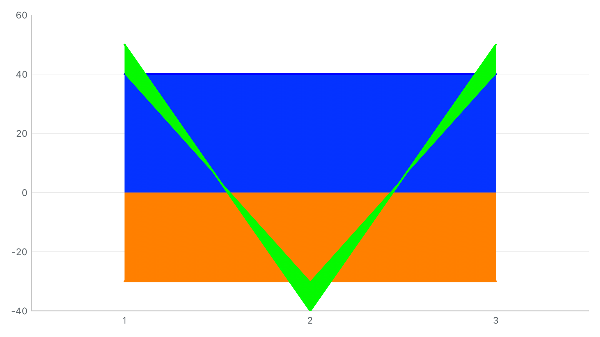
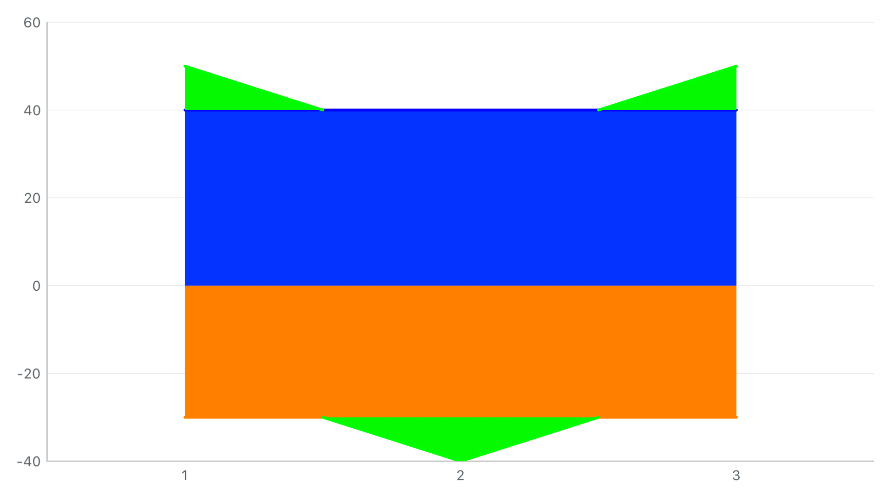

# 2026-09-30 G1 第二批：跨零正负基线分片

沿用 `StackedAreaBoundaryMode.followBaseline` 与 OC `stackedAreaFollowsBaseline`，正、负基线均可确定时，将当前层在自身厚度过零处拆成独立面积片。曲线数值求根 / 贝塞尔分段，阶梯在实际跳变处拆开；描边不会连接不同符号的基线。原始数据、零值归属、索引、堆叠数学与命中点保留。

适用普通、序号分组、固定基准百分比；默认独立插值保持。前层链切换、无连续基线的缺测、自动百分比仍待续，G1 整体仍部分完成。

## 同输入前后

正基线 `[40,40,40]`，负基线 `[-30,-30,-30]`，当前层 `[10,-10,10]`，均为直线。此前开启沿基线模式也会回退为斜穿两层基底的面积。

| 修复前 | 修复后 |
| --- | --- |
|  |  |

图像来自真实 HYMChartView 渲染，没有修图。修复前在 `x=0.25` 的 `y=25/42` 和 `x=0.75` 的 `y=-15/-32` 共 4 条包含断言失败；修复后通过。正片收敛到 +40、负片在 -30 展开；同一 X 的两片可以分离，不填满两条基线之间的区域。

现有页面搜索“跨零正负”，加载“跨零正负基线面积对照场景”，再搜索“堆叠面积边界”切换模式：

- [折线图：沿基线](crossing-area-follow-baseline-折线图.png) / [独立插值](crossing-area-independent-折线图.png)
- [混合图：沿基线](crossing-area-follow-baseline-混合图.png) / [独立插值](crossing-area-independent-混合图.png)

## 验证结果

环境：Xcode 26.3（17C529），iPhone 15 Pro / iOS 17.2，arm64，UUID `23C39E52-9B21-4992-9121-5730E201718C`。

| 运行 | 结果 | 原始结果包 |
| --- | --- | --- |
| 修复前红测 | 1 用例失败 / 4 条断言失败，符合复现预期 | `/tmp/charts-g1-crossing-before-20260930.xcresult` |
| 首轮核心回归 | 19 通过，包含前批次兼容与薄层用例 | `/tmp/charts-g1-crossing-core-20260930.xcresult` |
| 完整单元 + 三项 Demo UI | **279 通过：276 单元 + 3 UI，0 失败** | `/tmp/charts-g1-crossing-final-20260930.xcresult` |
| 自动百分比跨零契约补测 | **6 通过**，重复跨零测试套件，不增加独立用例数 | `/tmp/charts-g1-crossing-contract-20260930.xcresult` |
| 大坐标零值端点补测 | **25 项面积几何通过**，见 `endpoints-summary.json` | `/tmp/charts-g1-crossing-endpoints-20260930.xcresult` |
| 独立 Swift / OC Release 宿主 | **2 通过**，新文件纳入最终独立产品 | `/tmp/charts-g1-crossing-integration-final-20260930.xcresult` |

完整回归后加强了自动百分比的真实跨零输入检查；又补上零值端点的精确保留，避免视口外大坐标运算引入消减误差，使零宽裁切区间反转。后者回归 25 项面积几何，并重建 / 重跑独立 Release 宿主；Demo 运行源码未再修改。原 150 组同符号薄层、40 组精确底边检查继续通过；本批新增跨零 **150 组**：5 组正/负基线线型搭配（负线型轮换）× 5 种当前线型 × 2 个符号方向 × 3 种堆叠。每区间内部取 22 个非零探针，检查两条基线内侧不被当前层填充、外侧只有对应一片；描边不穿过零轴连接正负基线。没有把它描述为全部 5³ 种三层线型排列。

另覆盖：平滑曲线真实零点而非线性比例、原始零样本属于正链、端点阶梯、可连接的上层缺测、前层断段回退、显隐、保留视口、数据 / 模式更新、轴和 stackID 隔离、Line / Combined 实际 Demo 输入一致、OC 开关、自动百分比继续使用兼容路径。几何分点不加入 renderedIndices 或命中数据。

Demo 仍为 **258 个可编辑项 / 2,801 次绑定读写**，现有 17 个预设 / 289 组有序切换；750 组旧组合矩阵通过。三个 UI 用例各覆盖折线 / 混合图，包含新跨零、上一批薄层和原正负缺测场景。保存 10 张 UI 图与清单，文件名及散列见 `ui-attachments.json`。

中间验证的问题与处理也保留：初次矩阵探针恰好落在一个真实零厚度位置，不能要求那里存在面积，改用避开该零点的探针；测试将折线 Demo 的无 kind 模型直接送给 Combined，后者按既定契约当成柱图，导致测试图层数组越界，已改为分别走两页真实模型并加入安全展开。该对照同时发现新预设的两页线型不一致，已增加显式系列线型，使结果一致。`matrix.log.gz`、`targeted.log.gz` 保存失败记录；最终通过结果来自修正后重跑。

## 重跑与归档

```sh
xcodebuild -project SwiftFunctionProject.xcodeproj -scheme SwiftFunctionProject \
  -configuration Debug \
  -destination 'platform=iOS Simulator,id=23C39E52-9B21-4992-9121-5730E201718C,arch=arm64' \
  -parallel-testing-enabled NO -collect-test-diagnostics never \
  -only-testing:SwiftFunctionProjectTests \
  -only-testing:SwiftFunctionProjectUITests/ChartDemoUITests/testCrossingStackedAreaBoundaryComparisonInBothDemos \
  -only-testing:SwiftFunctionProjectUITests/ChartDemoUITests/testThinStackedAreaBoundaryComparisonInBothDemos \
  -only-testing:SwiftFunctionProjectUITests/ChartDemoUITests/testStackedAreaSeamPresetInLineAndCombinedDemos \
  -resultBundlePath /tmp/charts-crossing-replay.xcresult test CODE_SIGNING_ALLOWED=NO
```

- `source-snapshot.json/tar.gz` 留存本批最终工作区输入，基于相同 Git 基线覆盖重放；修复前核心可对照前批次归档。仓库有既有未提交改动，不只依赖 HEAD。
- `*-summary.json`、`*.log.gz` 保存实际结果；结果包在 `/tmp`，清理后需重跑。
- `product-audit.json` 确认 Release framework 的公开 Swift / OC 入口、六种 SwiftUI 包装和 @rpath，无 AA/JS/WebKit/App / Demo 资源依赖。独立工程现含 76 份 Swift 源文件。宿主维持原基础输入；跨零图形由本批主工程及 Demo 测试验收。
- `evidence-files.json` / `verify_evidence.py` 核对保存材料与源码散列，不代替测试。

未重跑旧 AA Demo、所有 UI 用例或真机，也未新增性能 / 主题切换结论。剩余工作与默认行为见[面积指南](../../../charts-stacked-area-seams-guide.md)和[实施计划](../../../charts-legacy-replacement-plan.md)。
