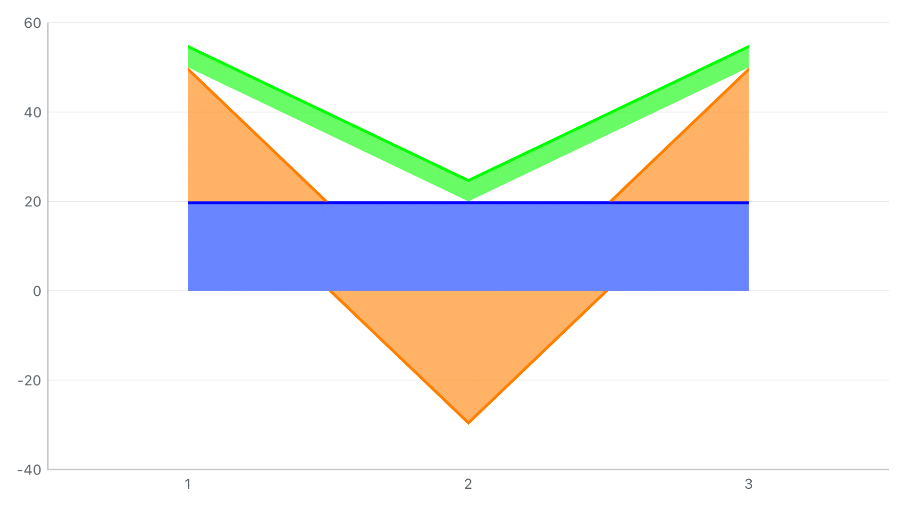
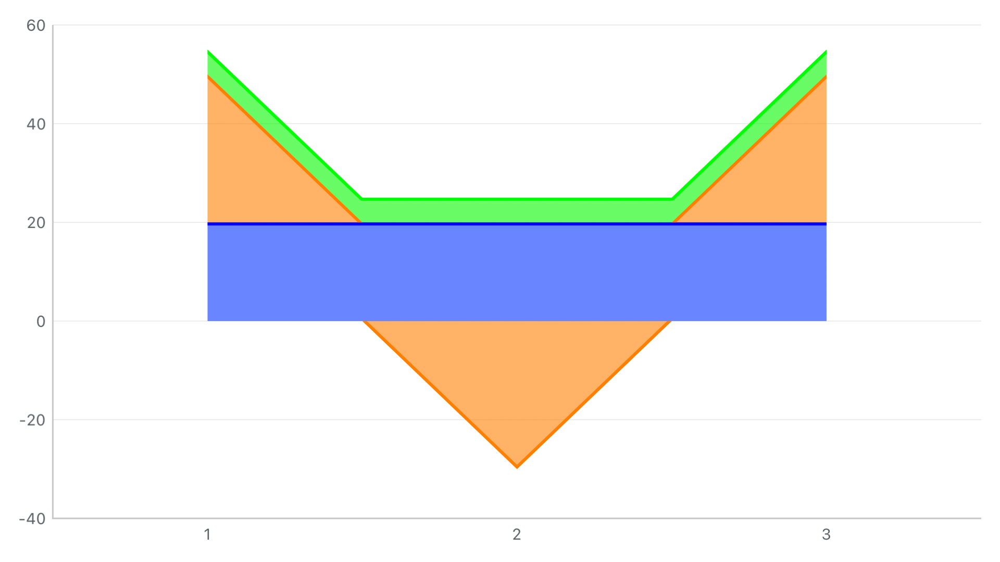

# G1：前层跨零后，上层连续跟随正负基线

本批解决前层已经分片、上层仍在两个采样基线之间斜连所留下的空隙。复用现有 `.followBaseline` / OC `stackedAreaFollowsBaseline`，不增加公共开关，不改变采样点累计值或命中索引。

## 修复前后

真实 HYMChartView 渲染，三条直线面积依次为 `[20,20,20]`、`[30,-30,30]`、`[5,5,5]`，普通堆叠、沿基线模式，关闭 marker。两张图配置相同，均未经修图。

| 修复前 | 修复后 |
| --- | --- |
|  |  |

在横坐标 `0.5`，橙色层自身厚度降至零，绿色层应占据 `20…25`。旧逻辑仍将其画在 `35…40`，与蓝色基底分离。本轮保存每个已解析区间的正、负累计边界；某层退出正链时，正边界回到更早的基底，上层据此衔接。曲线保留贝塞尔片段，阶梯保留垂直边，不做折线近似。

最小复现先在修复前运行，四条区域断言全部失败；最终同一用例全部通过。此前修复的描边裁剪继续生效，描边收在各自面积内。

## Demo 复查

现有 **折线图 / 混合图** 搜索 `前层换链`，加载 **前层换链面积对照场景**。数据同上，但使用平滑曲线，默认关闭采样标记。通过已有“堆叠面积边界”切换沿基线与独立插值；可继续修改线型、数据、显隐和跨空值连线。

- 折线图：[沿基线](source-switch-area-follow-baseline-折线图.png)、[独立插值](source-switch-area-independent-折线图.png)。
- 混合图：[沿基线](source-switch-area-follow-baseline-混合图.png)、[独立插值](source-switch-area-independent-混合图.png)。
- 上一批自身跨零场景也重跑：折线图 [开启标记](crossing-area-follow-baseline-折线图.png) / [关闭标记](crossing-area-no-markers-折线图.png)，混合图 [开启标记](crossing-area-follow-baseline-混合图.png) / [关闭标记](crossing-area-no-markers-混合图.png)。

## 真实旧 AA 封装的同输入结果

新增共享输入 `Examples/ChartComparisonFixtures/chart-area-boundaries-v1.json`，旧 Demo 与新单元测试实际读取同一文件。两组样本顶层和三个业务系列均为 `areaspline`，分别覆盖自身跨零和前层换链。旧参考模块未修改，仍走原来的正负副本及透明辅助系列转换；3 条业务系列展开为 7 条引擎系列，运行时 Highcharts 为 **11.4.3**。

| 场景 | 旧封装实图 / 引擎采样 | 新实现实图 / 采样 |
| --- | --- | --- |
| 自身跨零 | [图片](legacy-boundary-crossing.png) / [JSON](legacy-boundary-crossing.json) | [图片](native-boundary-crossing.png) / [JSON](native-boundary-crossing.json) |
| 前层换链 | [图片](legacy-boundary-source-switch.png) / [JSON](legacy-boundary-source-switch.json) | [图片](native-boundary-source-switch.png) / [JSON](native-boundary-source-switch.json) |

前层换链样本的累计结果如下；旧值取各业务系列的正值副本 `stackY`，负值副本另列于原始 JSON，不能忽略它们直接当成完整新旧一一对应关系。

| 业务系列原值 | 旧正值副本累计 | 新正负独立累计 |
| --- | --- | --- |
| 固定基底 `[20,20,20]` | `[55,-5,55]` | `[20,20,20]` |
| 跨零前层 `[30,-30,30]` | `[35,-25,35]`（中间点副本原值为 0） | `[50,-30,50]` |
| 同符号上层 `[5,5,5]` | `[5,-25,5]` | `[55,25,55]` |

这说明当前旧封装的转换与堆叠顺序存在具体语义差异：上层原值 `+5` 的中间点，在旧图累计为 `−25`，新图累计为 `+25`。本轮修复的是新侧采样点之间的连续边界，未改变新侧累计规则，也没有据此断言原生 Highcharts 的所有配置都存在该问题。

这里的“同输入”限于业务数值和面积曲线类型；两端视图尺寸、默认轴、系列名称和颜色配置并未全部归一，**不是像素金图比对**。可运行 `python3 compare_snapshots.py`，从归档共享输入重新校验正负副本、透明辅助数据、新侧正负累计及上述差异。

## 验证结果

Xcode 26.3，iPhone 15 Pro / iOS 17.2，arm64，模拟器 UUID `23C39E52-9B21-4992-9121-5730E201718C`。

| 验证 | 最终结果 |
| --- | --- |
| 全部单元测试 | **288 通过，0 失败**，包含新增 7 项前层换链测试 |
| 本批图表 UI | **2 通过，0 失败**，覆盖折线/混合两页、两种边界模式、标记开关与恢复默认；保存 10 张页面图 |
| 真实旧 AA 共享输入 UI | **1 通过，0 失败**，包含两组样本 |
| 独立 Release framework / Swift、OC 宿主 | build-for-testing 通过；产物依赖审计通过；**2 项运行 UI 测试通过** |
| 原 Demo 自动检查 | 258 可编辑项、2,801 次绑定读写；18 个预设 / 324 组有序切换；750 组组合渲染通过 |

新增测试包括：

1. 五种下层线型 × 五种上层线型 × 正负方向 × 普通/固定基准百分比/分组，共 **150 组**四层组合；用原值插值的正负分量累计作为独立参考，检查两个上层的厚度、底边和下层覆盖。每个区间取 5 个位置，不宣称穷尽所有像素。
2. 上层跨多个缺测点连接时，沿用下层所有已解析跨零片；下层真正断开时保留回退，启用跨空值连接后再恢复可确定边界，不把缺测补零。
3. 五种线型 × 三层 × 1×/2×/3×，共 **45 次描边栅格足迹检查**。允许一物理像素的抗锯齿边缘，同时断言描边未整体消失；此前描边专项用例也随完整单元集通过。
4. 显隐、数据、stackID、次轴、模式、空数据及视口更新的复用结果与全新绘制一致；Line/Combined 面积路径一致，OC 开关可正确更新，原始命中仍返回业务采样。

## 失败记录与可复查性

- `before.log.gz`：最小复现的四条断言失败，记录修复前缺陷。
- `core.log.gz`：初步实现后，旧测试仍把现在已经可解析的符号切换当作不支持场景，产生 2 条断言失败。更新该预期，保留真正缺测的回退断言；新增矩阵验证已支持行为。
- `matrix.log.gz`：阶段性面积相关 34 项测试通过；最终以 `final.log.gz` / `final-summary.json` 的 **290 项全通过**为准。
- `legacy.log.gz`：初次样本显式 `area` 与顶层 `areaspline` 混用，仅留开发历史。最终输入统一为 `areaspline` 后重跑，采用 `legacy-final.log.gz` / `legacy-final-summary.json` 的图像与 JSON。
- `product.log.gz`、`product-audit.json`、`integration.log.gz`、`integration-summary.json`：独立 Release 构建、依赖和运行证据。最终验证后仅整理文档与归档，未再改产品实现或 XCTest 断言。

结果包位于 `/tmp/charts-g1-envelope-{before,matrix,final,legacy-final,integration}-20260930.xcresult`，临时目录清理后需重跑。附件清单记录原测试名与 SHA-256；`source-snapshot.json/tar.gz` 保存 Git 基线上的工作区构建输入和相关文档，包含既有未提交工作。`verify_evidence.py` 核验保存文件与数字，不代替运行 XCTest。

在仓库根目录重跑本批新侧验证：

```sh
xcodebuild -project SwiftFunctionProject.xcodeproj -scheme SwiftFunctionProject \
  -configuration Debug \
  -destination 'platform=iOS Simulator,id=23C39E52-9B21-4992-9121-5730E201718C,arch=arm64' \
  -parallel-testing-enabled NO -collect-test-diagnostics never \
  -only-testing:SwiftFunctionProjectTests \
  -only-testing:SwiftFunctionProjectUITests/ChartDemoUITests/testSourceSwitchStackedAreaBoundaryComparisonInBothDemos \
  -only-testing:SwiftFunctionProjectUITests/ChartDemoUITests/testCrossingStackedAreaBoundaryComparisonInBothDemos \
  -resultBundlePath /tmp/charts-envelope-replay.xcresult test CODE_SIGNING_ALLOWED=NO
```

旧侧使用 `LegacyChartDemo` scheme，仅运行 `LegacyChartDemoUITests/LegacyChartDemoUITests/testBoundaryCrossingAndSourceSwitchSharedInputs`。独立宿主运行方法见 [Integration 说明](../../../../Examples/ChartsIntegration/README.md)。

本批只完成**已解析前层换链**。无法确定连续基线的缺测组合与自动百分比仍按[实施计划](../../../charts-legacy-replacement-plan.md)推进；没有新增真机、多系统、大规模性能或全部 UI 场景回归的验收结论。
