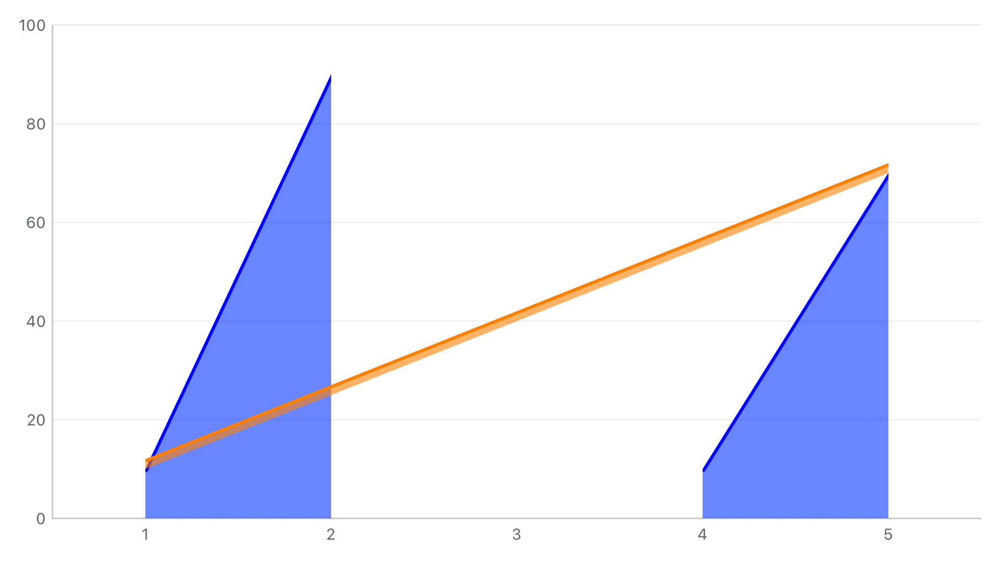
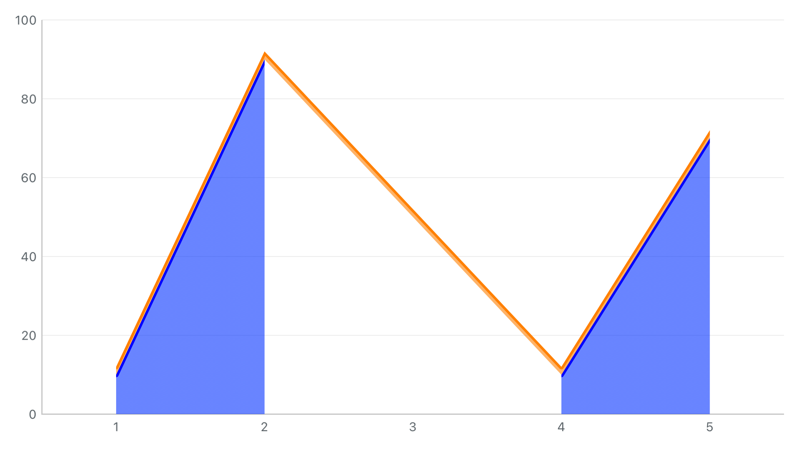

# G1：保留缺测两侧的真实底边

本批修复“上层跨长缺测连接，下层中间断开”时整段丢失共享轮廓的问题。沿用 `.followBaseline` / OC `stackedAreaFollowsBaseline`，不增加公共开关。

## 修复前后

两张图是相同配置的 HYMChartView 输出，未经修图。下层 `[10,90,NaN,10,70]` 使用平滑曲线且断开；上层 `[2,NaN,NaN,NaN,2]` 使用直线且连接；普通堆叠、沿基线模式、关闭 marker。

| 修复前 | 修复后 |
| --- | --- |
|  |  |

以前上层整个 `0…4` 区间（索引从 0 起算）都使用基准端点直线，丢失下层的 `0…1` 和 `3…4` 两段轮廓，导致上层薄带画到下层内部或离开实际基底。现在保留两侧实际路径，只有真正缺口 `1…3` 使用累计基准的直线过渡；上层自身厚度叠加到该基线上。最小复现在修复前有 **3 条包含关系断言失败**，最终同一用例通过。

缺口中央下层仍空白。上层设置为跨缺测连接，因此有自己的过渡薄带；它不表示下层补齐了数据。原始 NaN、raw/base/draw、命中与 `renderedIndices` 保留，细分交点不是新增业务采样。

## 实现与范围

新增内部 `LineStackedAreaGapBaseline.swift`，按同数学堆叠链中各实际连续段的起止索引细分未解析区间。能够连续复用的子区间保留贝塞尔控制点、阶梯边和正负累计轮廓；真正缺口分别连接正、负累计基准。上层自己跨零时仍按厚度零点分片，描边收在面积内部。

同时补查后来系列在区间内部的贡献：中层两端缺测、内部有有效片段时，不能直接借用更早的平坦基底而忽略这些片段。已生成的累计边界继续供后层复用。中间系列存在原始采样时，其累计基准也约束缓存的正负边界；过渡不一定仅由最外两端决定。

支持范围仍为普通、序号分组和固定基准百分比；默认独立插值与自动百分比兼容模式保持。共享轮廓可以精确贴合，**无唯一连续基线的缺口不保证所有层全域无重叠**。例如下层连接跨空值、上层在该缺测索引有有效点时，下层的可见插值与原始累计点可能冲突；本批不会通过修改业务值或强制更换缺测策略解决这种矛盾。

本批没有新增旧 AA 运行，也没有将新侧过渡规则描述为 AA 像素对齐。此前两组真实旧 AA 同输入结果保留在[前层换链批次](../2026-09-30-g1-envelope/README.md)。

## Demo

现有 **折线图 / 混合图** 搜索 `缺测底边`，加载 **缺测底边分段面积对照场景**。为更清楚观察曲线，Demo 使用 7 点：下层 `[10,90,20,NaN,70,15,50]`，上层 `[4,NaN,NaN,NaN,NaN,NaN,4]`；默认关闭 marker。

- 折线图：[沿基线](gap-boundary-area-follow-baseline-折线图.png) / [独立插值](gap-boundary-area-independent-折线图.png)。
- 混合图：[沿基线](gap-boundary-area-follow-baseline-混合图.png) / [独立插值](gap-boundary-area-independent-混合图.png)。

可修改“编辑系列序号”后分别改变下层/上层的“跨空值连线”及显式“缺测策略”，再切换已有面积边界模式。预设共 19 个、361 组有序切换；可编辑项仍为 258 个，绑定读写检查仍为 2,801 次。

## 验证

环境：Xcode 26.3，iPhone 15 Pro / iOS 17.2 模拟器，arm64，UUID `23C39E52-9B21-4992-9121-5730E201718C`。

新增 8 项单元用例覆盖：

1. 最小复现保留两侧完整轮廓；缺口使用自己的薄层厚度，避免独立累计曲线穿过直线基准。
2. **150 组**五种下层线型 × 五种上层线型 × 正负方向 × 三种堆叠方式。比较源路径和逆向底边的端点/控制点，并检查更高一层继续复用；曲线内取样检查各层填充，原始缺测不增加命中。
3. 中层首尾缺测而内部存在两段有效数据；跨零上层分别使用正负过渡，源缺口保持空白。
4. NaN / 正无穷 / 负无穷 × 六种缺测配置，共 **18 组**策略检查，包含显式策略覆盖 connectNulls、autoGap 数量阈值和时间阈值。
5. 五种线型 × 两层 × 1×/2×/3×，共 **30 次**描边栅格足迹检查，允许一物理像素抗锯齿边缘，并断言描边没有被整体裁掉。
6. 11 种状态下对象复用与全新绘制逐图一致：连接/断开、显隐、stackID、次轴、百分比、独立插值、空数据及改数；检查视口保留。
7. Line/Combined Demo 面积路径一致、OC 开关有效、实际点击返回原值与索引。

最终结果：

| 检查 | 结果 |
| --- | --- |
| 全部单元测试 | **296 通过，0 失败**，含新增 8 项缺测底边用例 |
| 三条 Demo UI | **3 通过，0 失败**，缺测/前层换链/自身跨零均覆盖 Line、Combined；保存 14 张页面图 |
| 独立 Release framework / Swift、OC 宿主 | build-for-testing 与产物依赖检查通过；**2 项宿主运行 UI 通过** |
| Demo 控件与组合 | 258 可编辑项、2,801 次绑定读写；19 预设 / 361 组有序切换；750 组组合渲染通过 |

摘要为 `final-summary.json`（299 项全通过）及 `integration-summary.json`，对应 `final.log.gz` / `integration.log.gz`；独立构建见 `product.log.gz` / `product-audit.json`。独立工程重新生成后包含 78 份 Swift 源码，无 AA/JS/WebKit/App/Demo 依赖；该批宿主沿用基础输入，面积几何由主工程上述用例验证。已人工查看本批前后图及两页缺测截图。最终运行后仅整理文档、OC API 注释和归档，未再修改产品实现或 XCTest 断言。

开发过程完整保留：

- `before.log.gz`：2 个初始用例中最小复现失败 3 条断言；另一个初版厚度样本没有复现反填，后来改为具有邻点转折的基准，并由最终用例检查，不能将其算作修复前已证实失败。
- `core.log.gz`：新最小用例通过；已有测试仍要求整段回退/不分片，4 条旧预期失败。改为验证已支持的分段，同时检查下层仍为空。
- `matrix.log.gz`：8 项新用例全部通过；另一个跨零回归的新增探针错误地假定正基准始终为 40，忽略中间系列在缺测索引的累计基准为 0。按该既有采样约束修正探针后纳入最终全量回归；不是修改数据或删除检查。

原始 xcresult 位于 `/tmp/charts-g1-gaps-{before,core,matrix,final}-20260930.xcresult`，临时目录清理后需重跑。附件清单记录测试归属与 SHA-256；`source-snapshot.json/tar.gz` 保存当前构建输入和相关文档，包含既有未提交工作。`verify_evidence.py` 检查保存文件，不代替运行 XCTest。

重跑新侧完整单元集和本批三条 UI（在仓库根目录，结果目录须不存在）：

```sh
xcodebuild -project SwiftFunctionProject.xcodeproj -scheme SwiftFunctionProject \
  -configuration Debug \
  -destination 'platform=iOS Simulator,id=23C39E52-9B21-4992-9121-5730E201718C,arch=arm64' \
  -derivedDataPath /tmp/SwiftFunctionProject-validation \
  -parallel-testing-enabled NO -collect-test-diagnostics never \
  -only-testing:SwiftFunctionProjectTests \
  -only-testing:SwiftFunctionProjectUITests/ChartDemoUITests/testGapBoundaryStackedAreaComparisonInBothDemos \
  -only-testing:SwiftFunctionProjectUITests/ChartDemoUITests/testSourceSwitchStackedAreaBoundaryComparisonInBothDemos \
  -only-testing:SwiftFunctionProjectUITests/ChartDemoUITests/testCrossingStackedAreaBoundaryComparisonInBothDemos \
  -resultBundlePath /tmp/charts-gap-replay.xcresult test CODE_SIGNING_ALLOWED=NO
```

下一批为自动百分比的沿基线边界与 ±100% 外包络，见[实施计划](../../../charts-legacy-replacement-plan.md)。G1 仍不等于任意缺测策略下的全域无缝，更不等于老项目已完成替换；本批没有新增真机、多系统或性能验收结论。
