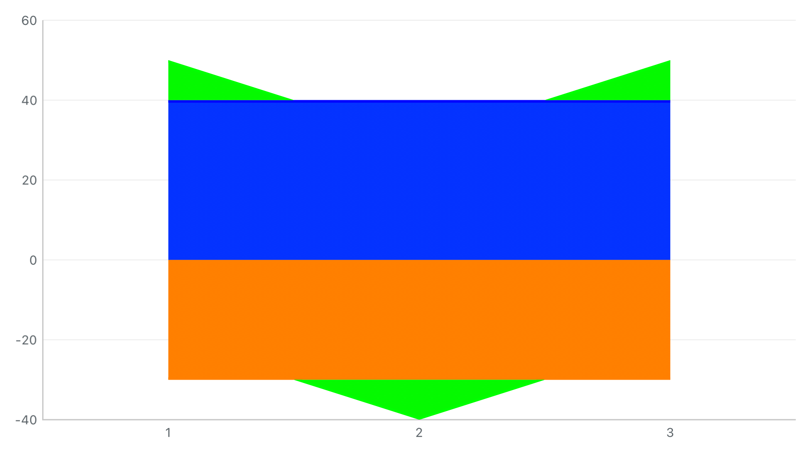

# G1 补修：交界绿点与描边端点外凸

用户指出第二批 after 仍有绿色小点压入蓝/橙基底，以及每层左右端点外凸。已确认该图关闭数据点，问题来自圆形端帽和居中描边。上一轮面积路径检查通过，遗漏了有宽度描边的像素边界。

## 原图与本轮结果

两图均为真实 HYMChartView 输出，没有修图；输入都是 `[40,40,40]`、`[-30,-30,-30]`、`[10,-10,10]`，直线、普通堆叠、沿基线模式，关闭 marker。before 原样复制自用户复查的上一批 after。

| 修复前（上一批 after） | 修复后 |
| --- | --- |
|  |  |

在既有 `.followBaseline` 模式下，完整面积边界同时用于描边裁剪。描边向面积内绘制，保留 `lineWidth` 内侧宽度；不移动边界或原始数据。零厚度片不会留下小圆点。默认独立插值、自动百分比和非堆叠外观保持。显式 marker 仍以样本点为中心，独立于面积裁剪；阴影仍按既有投影绘制。

Demo 使用原有跨零预设，可搜索 `showsPoints` 关闭采样标记检查边界：

- 折线图：[沿基线/有标记](crossing-area-follow-baseline-折线图.png)、[沿基线/无标记](crossing-area-no-markers-折线图.png)、[独立插值/无标记](crossing-area-independent-折线图.png)。
- 混合图：[沿基线/有标记](crossing-area-follow-baseline-混合图.png)、[沿基线/无标记](crossing-area-no-markers-混合图.png)、[独立插值/无标记](crossing-area-independent-混合图.png)。

## 本轮验证

Xcode 26.3，iPhone 15 Pro / iOS 17.2，arm64，UUID `23C39E52-9B21-4992-9121-5730E201718C`。

- **281 项单元测试通过**，含新增 5 项描边回归。结果包 `/tmp/charts-g1-stroke-final-20260930.xcresult` 同时记录首轮 UI 失败，因此其整体状态不是全通过；`regression-summary.json` 为 281 通过、1 失败。
- **1 项 UI 重跑通过**，覆盖折线和混合两个页面、关闭 marker、切换边界模式、恢复默认；保存 6 张页面图。结果包 `/tmp/charts-g1-stroke-ui-20260930.xcresult`；`ui-summary.json` 为 1 通过、0 失败。
- 独立 **Release framework、Swift/OC 宿主 build-for-testing 通过**；`product-audit.json` 确认公开入口、SwiftUI 包装、@rpath 和无旧库/Demo 依赖。本轮未重复执行独立宿主运行测试。
- Demo 控件仍为 **258 项 / 2,801 次绑定读写**，没有新开关或新页面。

新增像素检查：

1. 最小复现按 1×/2×/3× 实际渲染，检查完全落入基底内的可见绿像素，以及完全落在左右端面外的彩色像素，排除横跨边界的正常抗锯齿像素。为保证检测有效，同一几何临时恢复旧式居中描边作阳性对照，两项都能检出，见 [阳性对照](centered-stroke-control.png) / [本轮栅格图](raster-after.png)。颜色检测有明确阈值，未宣称边界混色绝对为零。
2. 五种连线 × 两档线宽（2 / 8 pt）× 三档倍率 × 三层，共 **90 次描边足迹比较**；实际描边栅格不得超过对应面积及一物理像素抗锯齿边缘，并断言描边未整体消失。
3. 核对实际内侧线宽、零面积不留描边，以及孤立零样本的 marker / 命中仍可用。
4. 对象复用与全新绘制在颜色分区、虚线、显隐、缺测、边界模式、自动百分比、关闭面积、空数据、缩放及 0.35 / 1 动画进度下逐图一致。
5. Line / Combined 同输入最终图片一致，OC 开关正确启用/清除描边裁剪。

中间失败记录保留：初版读取局部 seriesLayer 栅格，后来统一改为读取用户截图对应的完整视图；同时排除了蓝橙交界混色被误认作绿色的情况。最终加入旧式描边阳性对照确认两类缺陷确实能检出。`before/core/targeted.log.gz` 保存这些开发过程，初版计数不作为最终测量。首轮 UI 因状态说明变长，“恢复默认配置”落在懒加载列表可见区外而失败；加入滚动到按钮后，两页重跑通过。之后仅整理文档和测试注释，未修改产品源码或单元断言。

## 重跑与归档

```sh
xcodebuild -project SwiftFunctionProject.xcodeproj -scheme SwiftFunctionProject \
  -configuration Debug \
  -destination 'platform=iOS Simulator,id=23C39E52-9B21-4992-9121-5730E201718C,arch=arm64' \
  -parallel-testing-enabled NO -collect-test-diagnostics never \
  -only-testing:SwiftFunctionProjectTests \
  -only-testing:SwiftFunctionProjectUITests/ChartDemoUITests/testCrossingStackedAreaBoundaryComparisonInBothDemos \
  -resultBundlePath /tmp/charts-stroke-replay.xcresult test CODE_SIGNING_ALLOWED=NO
```

`source-snapshot.json/tar.gz` 留存最终工作区构建输入与相关文档，基于记录的 Git 基线覆盖重放；保留既有未提交工作。`evidence-files.json` 和 `verify_evidence.py` 验证保存文件，不代替运行测试。`/tmp` 结果包清理后需重新运行。

这次补修不代表 G1 全部完成。前层链切换、无连续基线缺测和自动百分比仍按[计划](../../../charts-legacy-replacement-plan.md)推进；未新增真机、多系统或性能验收结论。
