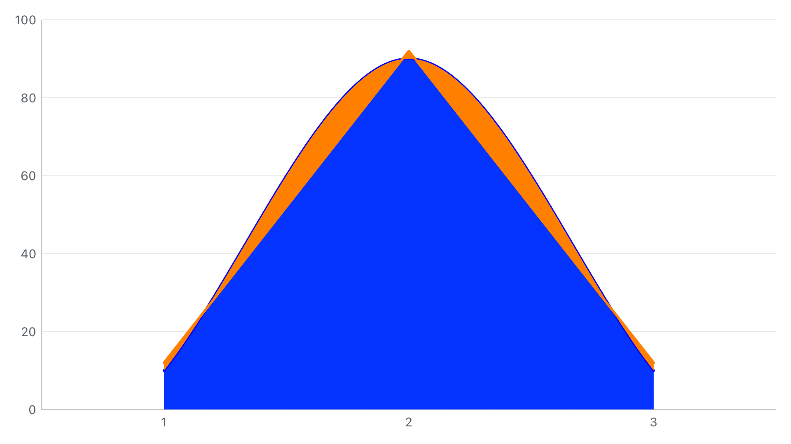
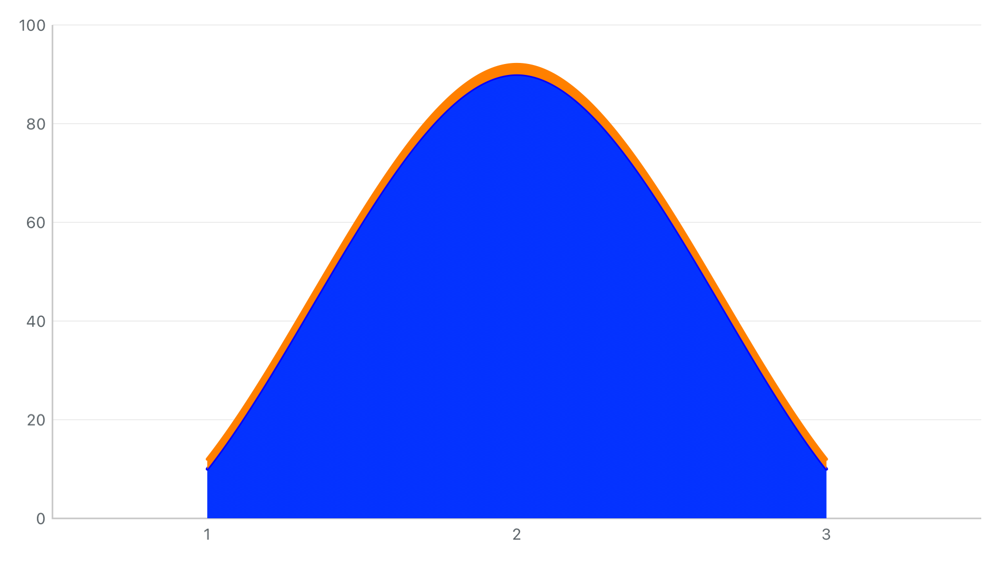

# 2026-09-30 G1 第一批：同符号薄层沿基线叠加

已实现可选 `StackedAreaBoundaryMode.followBaseline`，处理有共同基线的同符号薄层反向填充。Swift / OC、现有 Line / Combined Demo 已接入。默认仍为独立插值；自动百分比、跨零及无共同底边过渡尚未完成。这里是 G1 的第一批交付，不是全部 G1 或老模块替换验收。

## 前后效果

相同输入：底层 `[10,90,10]` 平滑曲线，上层 `[2,2,2]` 直线面积。旧模式在左半段中点将上层填入下层，同时缺少该边界外侧的填充；测试检查边界两侧 0.25 pt，修复前 2 条断言失败，新模式通过。

| 独立插值（修复前 / 默认兼容模式） | 沿基线叠加 |
| --- | --- |
|  |  |

截图来自真实 `HYMChartView` 图层渲染，无拼接或人工修图。上层描边也跟随同一条修正边界。Demo 另用三层、5 个点，验证曲线 + 直线薄层 + 居中阶梯：

- [折线图：沿基线](thin-area-follow-baseline-折线图.png) / [独立插值](thin-area-independent-折线图.png)
- [混合图：沿基线](thin-area-follow-baseline-混合图.png) / [独立插值](thin-area-independent-混合图.png)

## 实际运行

Xcode 26.3（17C529），iPhone 15 Pro / iOS 17.2，arm64，模拟器 UUID `23C39E52-9B21-4992-9121-5730E201718C`。

| 执行 | 结果和范围 | 结果包（临时目录） |
| --- | --- | --- |
| 修复前最小复现 | 1 用例失败 / 2 条包含断言失败，符合预期 | `/tmp/charts-g1-before-20260930.xcresult` |
| 几何 + Demo 定向验证 | 33 通过；18 几何 + 当时 15 Demo 用例 | `/tmp/charts-g1-matrix-20260930.xcresult` |
| 完整单元 + 两项 Demo UI | 单元 **269 通过**；原接缝 UI 通过，新薄层 UI 首轮失败，整包为 Failed | `/tmp/charts-g1-final-20260930.xcresult` |
| 修正模式状态提示后 | 16 Demo 单元和原接缝 UI 通过；新 UI 已完成切换，但恢复默认后的断言因未重新搜索状态失败 | `/tmp/charts-g1-ui-fixed-20260930.xcresult` |
| 修正 UI 操作后的最终运行 | **1 UI 用例通过，覆盖折线 / 混合图各自的模式切换和恢复默认** | `/tmp/charts-g1-ui-final-20260930.xcresult` |
| 独立 Swift / 纯 OC Release 宿主 | **2 通过**；编译与产物检查通过 | `/tmp/charts-g1-integration-20260930.xcresult` |

最终覆盖是 **269 个不同单元用例 + 2 个不同 Demo UI 用例**；后续 16 项 Demo 单元和原接缝 UI 的重复执行不叠加到总数。全量单元之后只修改 Demo 状态提示、测试恢复默认的查找步骤及文档注释；受影响的 Demo 单元已重跑。没有宣称最终 `final-summary.json` 整包通过，失败及修正过程完整保留。

新增核心验证：25 种上下层线型组合 × 正/负 × normal/percentFixed/grouped = **150 组**，每组有连续三层，比较精确共享边缘并在区间内部检查填充两侧。另验连接上层缺测保留下层中间节点、无共同底边/跨符号回退、隐藏/恢复、保留视口、切回兼容模式、自动百分比路径不变、Line/Combined 一致以及 OC 开关更新。原有 40 组路径检查继续通过。这里是数值几何检查及代表图检查，不是所有尺寸和参数的像素金图。

Demo 审计为 **258 个可编辑项 / 2,801 次绑定读写**，16 个预设 / 256 组有序切换；原 750 组组合渲染保持通过。

## 复现入口

在仓库根目录执行（结果路径使用不存在的新目录）：

```sh
xcodebuild -project SwiftFunctionProject.xcodeproj -scheme SwiftFunctionProject \
  -configuration Debug \
  -destination 'platform=iOS Simulator,id=23C39E52-9B21-4992-9121-5730E201718C,arch=arm64' \
  -parallel-testing-enabled NO -collect-test-diagnostics never \
  -only-testing:SwiftFunctionProjectTests \
  -only-testing:SwiftFunctionProjectUITests/ChartDemoUITests/testThinStackedAreaBoundaryComparisonInBothDemos \
  -only-testing:SwiftFunctionProjectUITests/ChartDemoUITests/testStackedAreaSeamPresetInLineAndCombinedDemos \
  -resultBundlePath /tmp/charts-g1-replay.xcresult test CODE_SIGNING_ALLOWED=NO
```

要观察兼容模式，进入折线图 / 混合图，搜索“薄层”，加载对照场景，再搜索“堆叠面积边界”切换。最小复现测试的 `boundary` 改为 `.independent` 可重现旧模式的两条断言失败；不要将这种有意红测当作新模式回归失败。

## 留存和边界

- `before/after.png`、四张最终 Demo 截图及 `control-inventory.json`。
- `*-summary.json` 和压缩日志：包含有意红测、完整单元、Demo 修复前后和独立宿主。第一次核心回归曾因缩短不等长系列基准数组导致越界；恢复逐索引补齐后通过，`core.log.gz` 保留这次开发中失败。
- `source-snapshot.json/tar.gz`：329 个当前输入文件及逐文件散列，沿用基础批次清单补入相关指南；用于覆盖相同 Git 基线重放。它记录最终工作区，不冒充修复前源码快照。修复前的已知核心基础可对照上一基础批次，红测代码可按上段重现。
- `product-audit.json`：Release framework 含新 Swift 枚举 / 属性及 OC 生成头属性，保留六种 SwiftUI 包装和 @rpath，无 AA/JS/WebKit/App / Demo 资源依赖。宿主通过普通 import / 纯 `.m` 编译使用新属性；具体面积路径行为由本批几何与 Demo 测试验证。
- `evidence-files.json` / `verify_evidence.py`：核对归档摘要和散列；不会代替实际重跑。

未新增真机、性能基准、暗亮主题切换或全量 UI 套件运行。独立宿主本批复验 Release，上一批 Debug / 设备构建证据保持历史属性。

后续 G1：当前层跨零、源链切换、无共同基线的缺测，以及自动百分比混合形态与总包络。完整替换仍按[实施计划](../../../charts-legacy-replacement-plan.md)推进。
