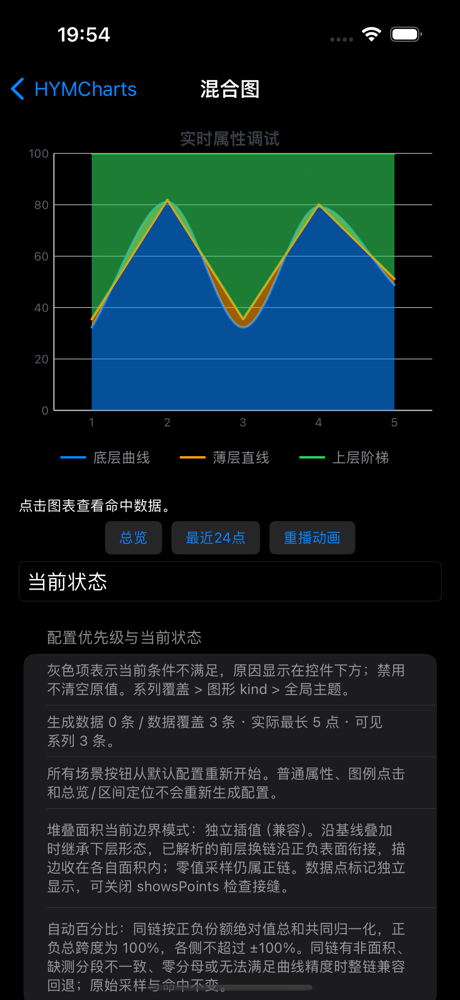
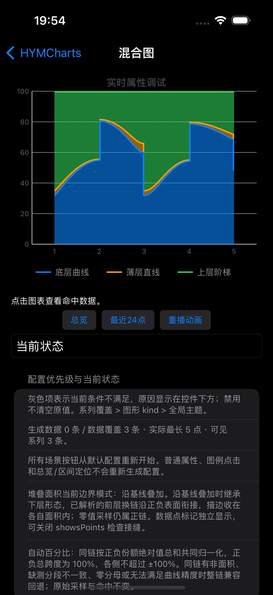

# G1 自动百分比面积：2026-10-02 补验记录

自动百分比沿基线模式此前已接入，但文档引用的 `2026-09-30-g1-percent` 目录没有保存到当前工作区。本目录是 **2026 年 10 月 2 日重新执行**的证据，不能当作 9 月 30 日历史结果包，也不是本日重新实现了一套算法。本次未更改 G1 的既定数学语义。

## 同一输入、两种边界模式

在现有折线图 / 混合图页搜索“百分比面积”，加载“自动百分比面积对照场景”。三组原值依次是 `[10,90,10,80,20]`、`[1,1,1,1,1]`、`[20,20,20,20,20]`，线型依次为平滑、直线、后置阶梯；百分比堆叠，关闭 marker。只切换已有“堆叠面积边界”控件，不换输入。

| 页面 | 兼容独立插值 | 沿基线共同归一化 |
| --- | --- | --- |
| 折线图 |  |  |
| 混合图 |  |  |

新模式先按各自线型插值采样份额，再共同归一化，并复用相邻层共享边界。在此全正预设中，绿色外边界保持 100%；阶梯改变共同分母时，蓝/橙层也会在同位置跳变，这是该模式的定义，不是原始数据增加了点。默认仍是兼容独立插值。

正负混合使用正负绝对值之和作共同分母，总跨度为 100%，不是正负各自铺满 100%。同链必须满足整体准入；不是全为面积、缺测分段/策略不兼容、采样或区间分母退化时整链显式回退，不静默填补业务值。不宣称任意缺测与跨零输入都全域无缝。本次没有重新运行旧 AA，也没有宣称与 AA 像素相同。

## 实际结果

环境：Xcode 26.3（17C529），iPhone 15 Pro / iOS 17.2 / arm64，模拟器 UUID `23C39E52-9B21-4992-9121-5730E201718C`。

- `PercentStackedAreaTests`：**8 项通过，0 失败**，13.133 秒。
- `testPercentStackedAreaComparisonInBothDemos`：**1 项通过，0 失败**，46.716 秒；覆盖折线 / 混合两页加载、模式切换与重置。
- `** TEST SUCCEEDED **`；完整本地结果包 `/tmp/HYMCharts-G1-percent-evidence-20261002.xcresult`。
- 便携[测试摘要](HYMCharts-G1-percent-evidence-20261002-summary.txt)、[原始日志压缩件](HYMCharts-G1-percent-evidence-20261002.log.gz)、[5 张原始附件清单及 SHA-256](screenshots.json)。其中 4 张为 UI，另有 [3× 单测绘图](native-percent-boundary.png)。临时 xcresult 清理后仍可检查仓库内附件，但要重跑才能重建原始结果包。

八项用例包括：250 组五种线型三层组合 × 正负方向的参考曲线核对；原值与索引不变；缺测同段连接/断开、整链回退；显隐/分组/次轴/视口与复用更新；1×/2×/3× 描边越界检查；归一化退化/工作量预算；Swift/OC 与两个既有 Demo 的相同几何。参考边界的屏幕坐标误差断言为 0.051pt；归一化细分另按 0.05pt 预算验证，不将有理曲线的近似说成逐点数学精确。

## 重跑

从仓库根目录执行，使用本机有效模拟器 UUID，结果目录必须尚不存在：

```sh
xcodebuild -project SwiftFunctionProject.xcodeproj -scheme SwiftFunctionProject \
  -configuration Debug \
  -destination 'platform=iOS Simulator,id=23C39E52-9B21-4992-9121-5730E201718C,arch=arm64' \
  -derivedDataPath /tmp/HYMCharts-G1-percent-rerun \
  -resultBundlePath /tmp/HYMCharts-G1-percent-rerun.xcresult \
  -parallel-testing-enabled NO -collect-test-diagnostics never \
  -only-testing:SwiftFunctionProjectTests/PercentStackedAreaTests \
  -only-testing:SwiftFunctionProjectUITests/ChartDemoUITests/testPercentStackedAreaComparisonInBothDemos \
  test CODE_SIGNING_ALLOWED=NO
```

接口与范围见[面积接缝指南](../../../charts-stacked-area-seams-guide.md)。后续 G2–G5 的完整实现及公共产物验证见[连续验收记录](../../../charts-presentation-g2-g5-2026-10-02.md)。这不等于真实业务接入、真机多系统验收或正式发布已经完成。
